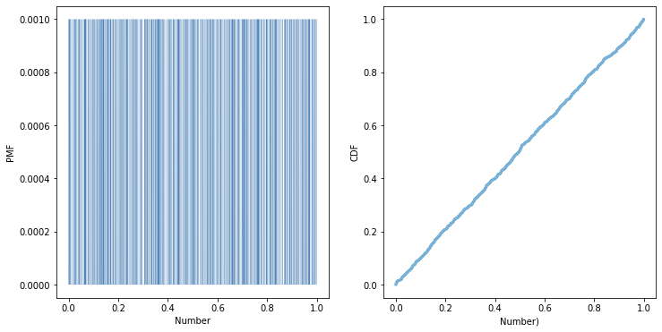

[Think Stats Chapter 4 Exercise 2](http://greenteapress.com/thinkstats2/html/thinkstats2005.html#toc41) (a random distribution)

We can easily illustrate this problem with the following code. I am naming the sample ```rs``` and its pmf and cdf ```pmf``` and ```cdf``` respectively. I am then plotting these functions, as shown below:
```import numpy as np
rs  = np.random.random(1000)
pmf = thinkstats2.Pmf(rs)
thinkplot.PrePlot(2, cols=2)
thinkplot.Pmf(pmf, linewidth=0.1)
thinkplot.Config(xlabel='Number', ylabel='PMF')

cdf = thinkstats2.Cdf(rs)
thinkplot.subplot(2)
thinkplot.Cdf(cdf)
thinkplot.Config(xlabel='Number)', ylabel='CDF')
```


It clearly shows, by the CDF, that the ditribution is uniform.

The reason the PMF appears strange is simply one of buckets. The random numbers between 0 and 1 are, for this example, 16-digit decimals. That implies that the chance of selecting more than one of the same number is... pretty much 0. Therfore it makes sense that the PMF bar-graph shows simply 1000 verital lines, each with height equal to 0.001, one one-thousandth. 